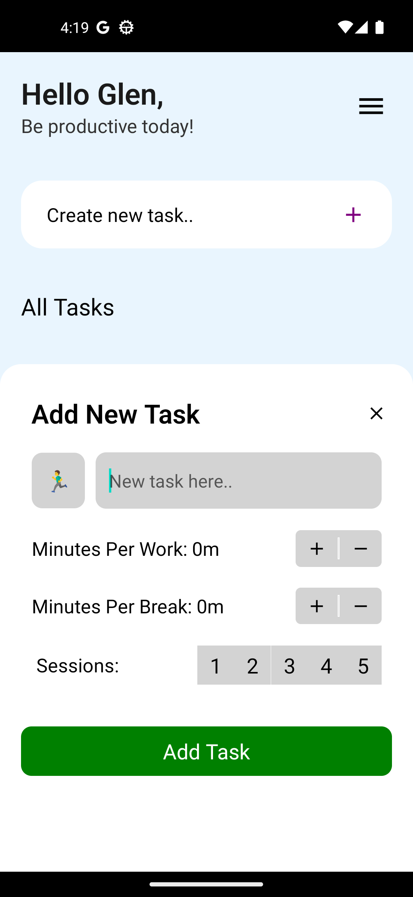
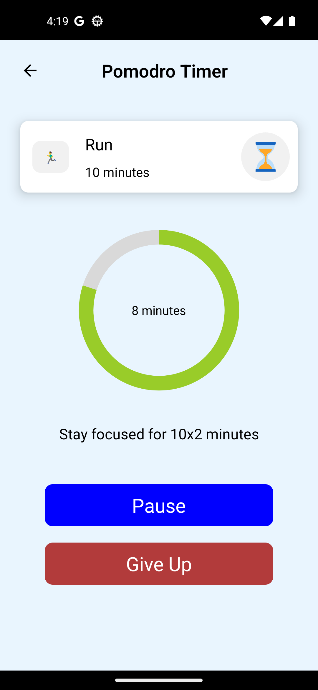

# Pomodro App
The Pomodoro App is a simple mobile application based on the Pomodoro technique, a time management method.

## Demo


## ScreenShots

<div>
  <h3>Home Screen </h3>
  
</div>

<div>
  <h3>Add Task </h3>
  
</div>

<div>
  <h3>Task Details </h3>
  
</div>

## Installation

- Clone project

```bash
  git clone https://github.com/ebubekirkarakurt/PomodroApp.git
  cd PomodroApp
```
- Install packages with NPM
 
```bash
  npm install
```
- Run db.json

``` bash
   json-server --host 0.0.0.0 db.json
```

- Go to this path and setup your IP
``` bash
   PomodroApp/src/config/api.ts

```

- Start metro server
 
```bash
  npx expo start
```